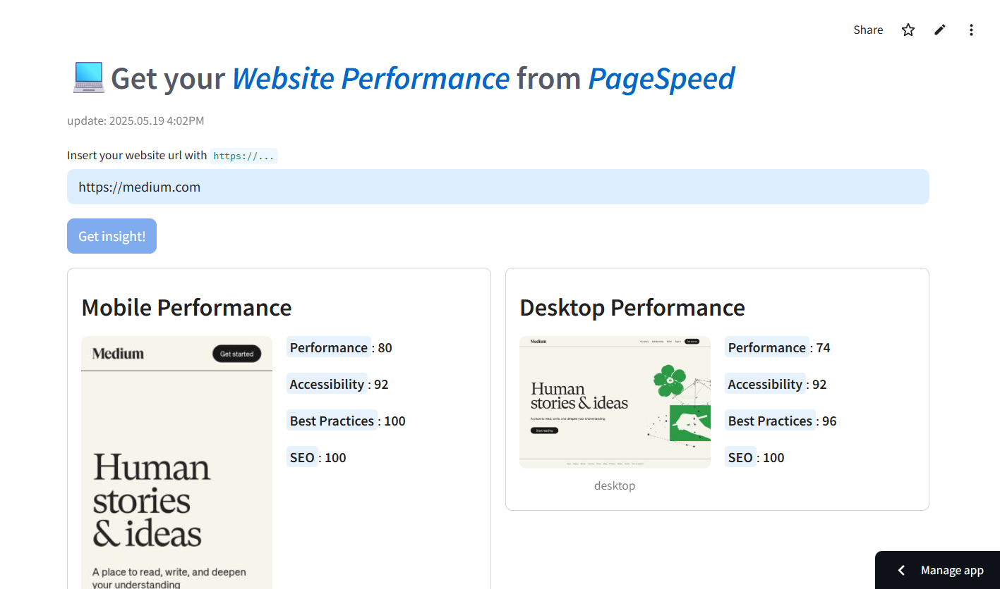
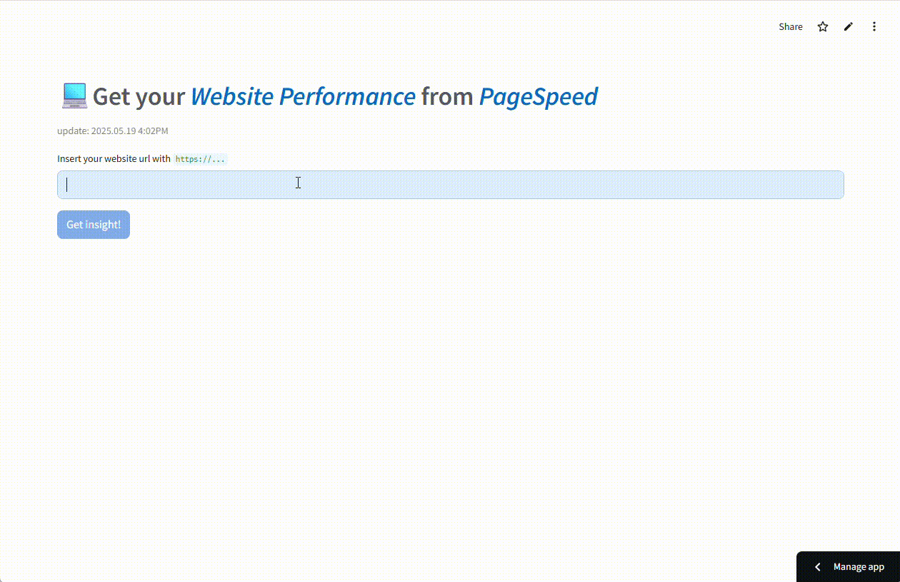

# Simple pagespeeed insight💻

This repository is simple app to get website performance (lighthouse score) for your website using python, streamlit, and pagespeed API. Additionally, there is login modal to access the feature.





## Features
- **Login** : restricts access to users with a valid app key
- **Mobile performace** : display website lighthouse score and mobile screenshot for your website
- **Desktop performace** : display website lighthouse score and desktop screenshot for your website

_Note : since pagespeed has excluded the PWA score from their reports, this project aligns with pagespeed's current metrics_


## Demo



## Requirements

- google pagespeed api key
- your app access key
```
GOOGLE_API_KEY=YOUR_GOOGLE_API_KEY
APP_TOKEN=YOUR_APP_ACCESS_KEY
```


